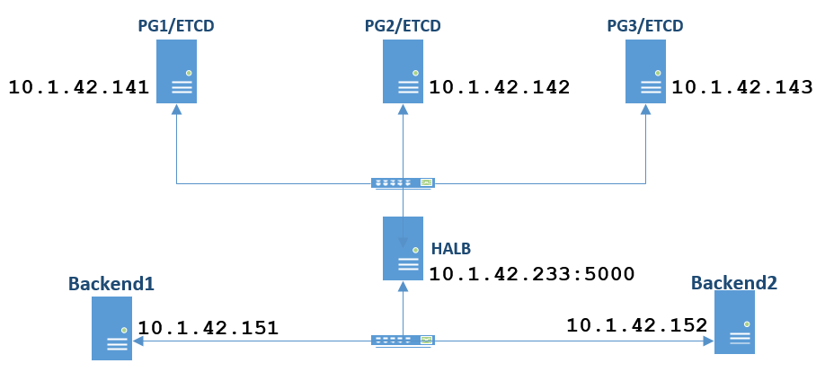

### This repository stores Vagrant code files to install and configure PostgreSQL master/slave cluster with HA and ETCD key/value store

#### Topology will be like as following:



| Server | Description |
| ------ | ----------- |
| HALB | Loadbalancer server which will handle requests from WEB servers to the **PG1** **PG2** and **PG3**. |
| PG1/ETCD    | ETCD, PostgreSQL and Patroni server. |
| PG2/ETCD    | ETCD, PostgreSQL and Patroni server. |
| PG3/ETCD    | ETCD, PostgreSQL and Patroni server. |

---
##### HALB - **10.1.42.233**
##### PG1/ETCD - **10.1.42.141**
##### PG2/ETCD - **10.1.42.142** 
##### PG3/ETCD - **10.1.42.143**
---

##### To start everything just clone repo and start servers with vagrant. 

``` bash
$ git clone https://github.com/jamalshahverdiev/vagrant-codes-in-practice.git && cd vagrant-jenkins-gitlab/
$ vagrant up pgsrv1 pgsrv2 pgsrv3 halb
$ vagrant.exe status
halb                      running (virtualbox)
pg1                       running (virtualbox)
pg2                       running (virtualbox)
pg3                       running (virtualbox)
```

##### To search inside of ETCD key/value server login to one of the PG servers and execute the following commands:

``` bash
$ etcdctl ls --recursive --sort -p /db
$ etcdctl get /db/postgres/optime/leader
$ etcdctl get /db/postgres/members/pg1
$ etcdctl get /db/postgres/members/pg2
$ etcdctl get /db/postgres/members/pg3
```

##### To test everything go to the HAProxy page and look at the master node (http://10.1.42.233:7000/):
 

##### To to write some data over HaProxy with 5000 port remotely with PgSQL client. Then shutdown master node and look at the HAproxy page and find Master node. Then over Haproxy try read written data from master PostgresSQL.

```bash
[root@halb ~]# psql -h 10.1.42.233 -p 5000 -U postgres
Password for user postgres:
psql (9.2.24, server 10.9)
WARNING: psql version 9.2, server version 10.0.
         Some psql features might not work.
Type "help" for help.

postgres=# CREATE database ntcdb;
postgres=# create user ntcuser;
postgres=# alter user ntcuser with encrypted password 'freebsd';
postgres=# grant all privileges on database ntcdb to ntcuser;
postgres=# \q
[root@halb ~]# psql -h 10.1.42.233 -p 5000 -U ntcuser ntcdb
Password for user ntcuser:
psql (9.2.24, server 10.9)
WARNING: psql version 9.2, server version 10.0.
         Some psql features might not work.
Type "help" for help.

ntcdb=> CREATE TABLE COMPANY(
   ID INT PRIMARY KEY     NOT NULL,
   NAME           TEXT    NOT NULL,
   AGE            INT     NOT NULL,
   ADDRESS        CHAR(50),
   SALARY         REAL
);
ntcdb=> CREATE TABLE DEPARTMENT(
   ID INT PRIMARY KEY      NOT NULL,
   DEPT           CHAR(50) NOT NULL,
   EMP_ID         INT      NOT NULL
);
ntcdb=> INSERT INTO department (id,dept,emp_id) VALUES (2, 'IT', 2);
ntcdb=> INSERT INTO company (id,name,age,address,salary) VALUES (1, 'Jamal', 32, 'Azerbaijan, Baku', 450);
ntcdb=> SELECT name,age FROM company;
ntcdb=> select * from department;
```


